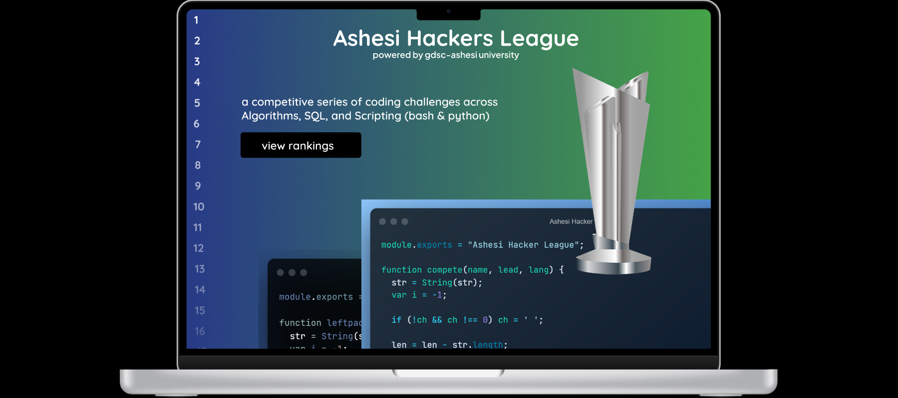

Competitive series of coding challenges across data structures and algorithms, scripting ( python & bash ) and SQL.

## UI/UX

[Figma](https://www.figma.com/file/wDMmmTr70gMdripbK2R06p/ashesi-hacker-league?node-id=0%3A1)

## Live

[Ashesi Hackers League](https://ashesi-hackers-league.web.app/)

## Technologies

- React
- Firebase
- Docker

## Sneak Peek

## Made with ❤️ by

- Oheneba Dade ([@Oheneba-Dade](https://github.com/Oheneba-Dade))
- Simon Boateng ([@Simon-157](https://github.com/Simon-157))
- Abdul Wahab Abass ([@WahabDev12](https://github.com/WahabDev12))
- Faddal Ibrahim ([@faddalibrahim](https://github.com/faddalibrahim))
