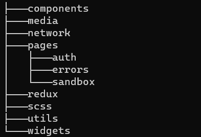

# PROJECT SETUP

## Public Folder

- [x] create \_redirects file for netlify deployment
- [x] del irrelevant files (default favicon)
- [x] generate temporal favicons with [real favicon generator](https://realfavicongenerator.net/)
- [ ] generate actual favicons with [real favicon generator](https://realfavicongenerator.net/)
- [ ] check favicons [favicon checker](https://realfavicongenerator.net/favicon_checker)
- [ ] use temporal logo from [logoipsum](https://logoipsum.com/) optionally
- [x] modify head of index.html (include generated favicons, icons, fonts)
- [x] modify manifest file (match theme-color with whats in index.html!)

## Root Files

- [ ] package.json : install all needed packages
- [x] jsconfig: configure absolute imports
- [ ] .env : SOURCEMAP=true
- [ ] cypress.json
- [ ] README.md : brief project detail
- [x] del irrelevant files (logo.svg)

## SRC folder



## Packages

- [x] axios
- [ ] prop-types?
- [x] react-router-dom
- [ ] redux (with logger, thunk, react-redux)
- [x] sass (with scss modules)
- [ ] cypress
- [x] json server

## Defaults

- [ ] debounce and throttle
- [ ] skeleton loading component
- [ ] Error404, ErrorBoundary

## Dev

- [x] protected branches
- [ ] secrets
- [ ] github actions, git hooks
- [ ] kanban board
- [ ] deploy dev branch
- [ ] netlify tests
- [ ] json server (to simulate api calls)
- [ ] lorem picsum for image placeholders
- [ ] cypress (with dashboard) -> netlify deployment
- [ ] webhooks (github + discord channel)
- [ ] test with lighthouse
- [ ] add pwa essentials (service worker etc)

## index.css

- [x] :root
- [x] css variables
- [x] resets
- [x] media queries
- [x] custom scrollbar

## fonts

- [x] google sans
- [ ] quicksand
- [ ] poppins
- [ ] roboto
- [ ] plus jakata sans

## Base css

```css
*,
*::before,
*::after {
  padding: 0;
  margin: 0;
  box-sizing: border-box;
}

/* width */
::-webkit-scrollbar {
  width: 10px;
}

/* Track */
::-webkit-scrollbar-track {
  background: #f1f1f1;
}

/* Handle */
::-webkit-scrollbar-thumb {
  background: #888;
}

/* Handle on hover */
::-webkit-scrollbar-thumb:hover {
  background: #555;
}

:root {
}

/* Small (sm) devices (landscape phones, 567px and up) */
@media screen and (max-width: 568px) {
  :root {
    --bg-color: #222;
    font-size: 22px;
  }
}

/* Medium (md) devices (tablets, 768px and up) */
@media screen and (min-width: 768px) {
  :root {
    --bg-color: #333;
    font-size: 24px;
  }
}
```

## .env

```json
GENERATE_SOURCEMAP=false
```

## \_redirects

```js
/* /index.html 200
```

## Proxy (in package.json)

```json
// only for development

"proxy": "http://localhost:4000",
```
